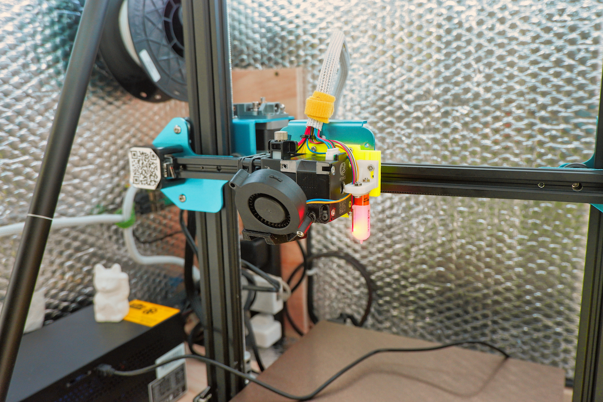

---

# CR10 V2 Stuff

I'd had enough of the bowden extruder on my CR10 v2... so much so that the alternative was a complete overhaul and upgrade of my whole printer in the form of an E3D Hemera. Here are all the parts, hardward lists and firmware setup for upgrading a CR10 v2 to a direct drive extruder and Marlin 2.0 Firmware 🤘

## 📦 Hardware

I purchased most of my upgrade hardware from the awesome chaps at 3DJake. Feel free to do the same or do some hunting around yourself. The Creality specific BLTouch cable was definitely worthwhile getting. Yes it's a little more expensive, but for a plug and play, it was worth it.

- E3D Hemera
- BLTouch
- Creality Magnetic Bed and PEI Sheet

## 🏗 Printed Parts

All of the below parts can be downloaded from this repo but i take no credit in the design or development of these parts. They're all available from the source links and thanks to all the creators for making these parts available 🙏

1. X Axis Bracket Adaptor
2. Hemera Bracket
3. BLTouch mount
4. Petsfang Cooling fan mount

## 🧠 Firmware

Takes advantage of Marlin 2.0.x (non bug-fix version) with some slight tweaks for this setup. You can download those from the [firmware]("./firmware/ "Firmware") directory.

For me, i've never had an issue using a USB connection and VSCode + Platform.io plugin. Your mileage may vary but overall, this setup seems to just work and shows any build errors or issues prior to trying to compile and upload.

---

