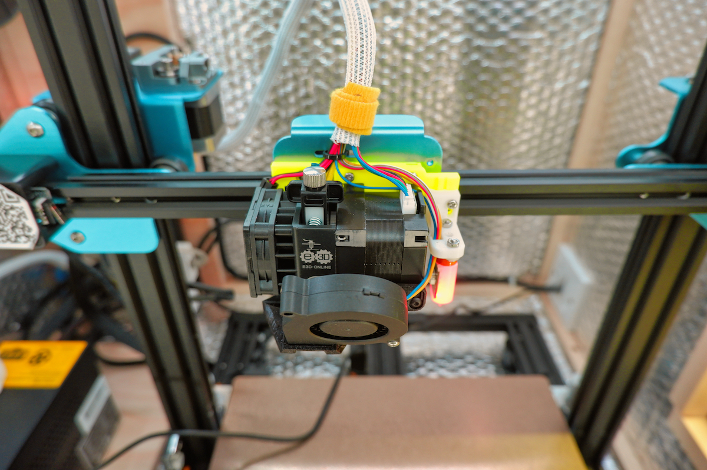

---

# CR10 V2 Stuff

I'd had enough of the bowden extruder on my CR10 v2... so much so that the alternative was a complete overhaul and upgrade of my whole printer in the form of an E3D Hemera. Here are all the parts, hardware lists and firmware setup for upgrading a CR10 v2 to a direct drive extruder and Klipper/Moonraker/Mainsail setup 🤘

## 📦 Hardware

I purchased most of my upgrade hardware from the awesome chaps at 3DJake. Feel free to do the same or do some hunting around yourself. The Creality specific BLTouch cable was definitely worthwhile getting. Yes it's a little more expensive, but for a plug and play, it was worth it.

- Creality CR10 V2 (obviously)
- Big Tree Tech SKR Mini E3 V2.0
- E3D Hemera
- BLTouch
- Magnetic Bed and PEI Sheet

## 🏗 Printed Parts

All of the below parts can be downloaded from this repo but i take no credit in the design or development of these parts. They're all available from the source links and thanks to all the creators for making these parts available 🙏

1. X Axis Bracket Adaptor
2. Hemera Bracket
3. BLTouch mount
4. Hangtight cooling duct ([source](https://www.thingiverse.com/thing:4042492/files))
5. Cable management clips and mounts

## 🧠 Config

Takes full advantage of Klipper and Moonraker via Mainsail.

You can download my setup config file from here -> [printer.cfg]("./printer.cfg "Mainsail Printer config"). Please be aware this is a work in progress and may not work for your setup. Please use it as a reference and adjust as necessary.

---

